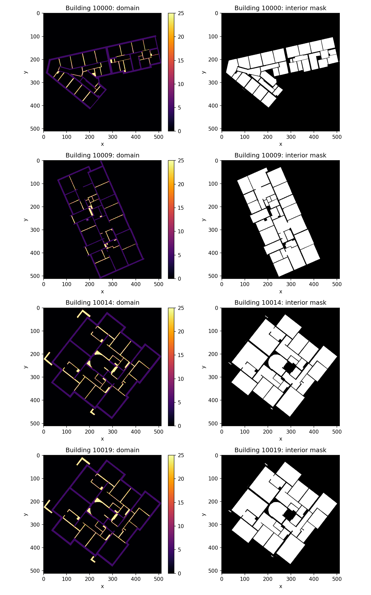
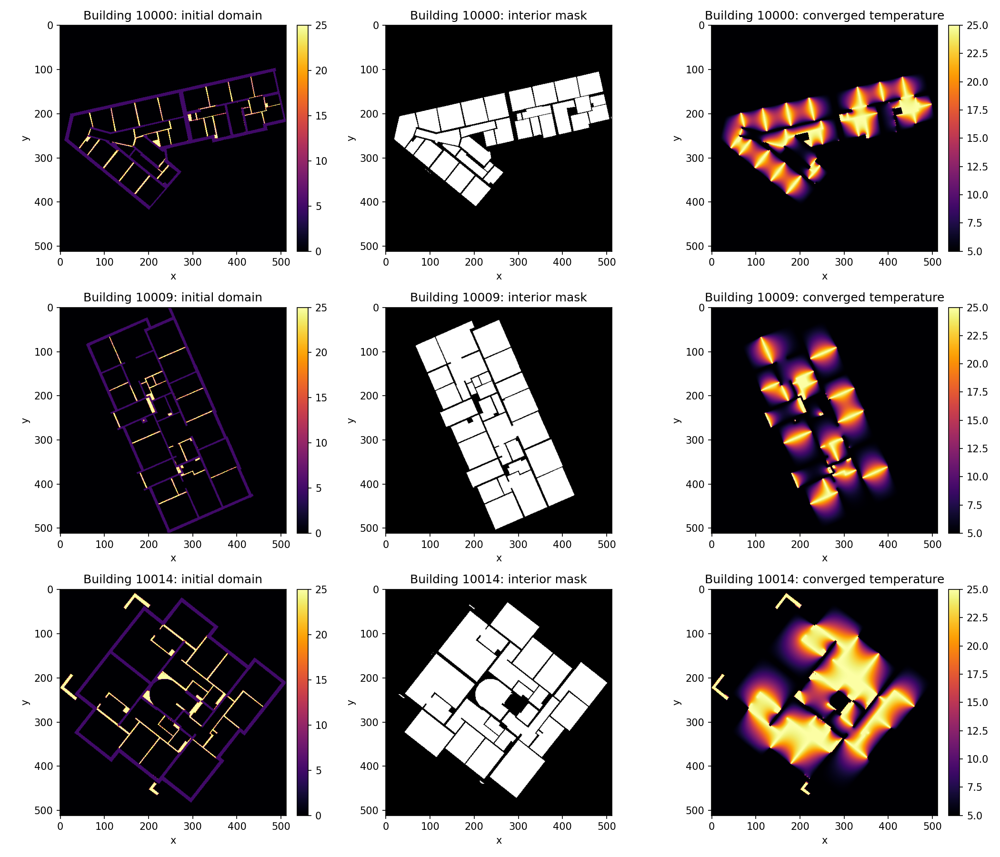

# Wall Heating: Task Results and Interpretation

Results and analysis for the Wall Heating mini-project. Tasks 1-4 are complete; tasks 5-12 are listed with their descriptions as a roadmap for remaining work.

---

## Task 1 - Visualize input data

> *"Familiarize yourself with the data. Load and visualize the input data for a few floorplans using a separate Python script, Jupyter notebook or your preferred tool."*

**Why this task matters:** Before running any simulations, we need to understand what the input data looks like. The two `.npy` files per building encode the physical setup of the Jacobi solver, knowing what they represent is necessary to correctly implement and later optimize the solver.

**Output:** [`tasks/task1/floorplan_inputs.png`](tasks/task1/floorplan_inputs.png)

**Results:**



**Interpretation:** Each building has two grids. The domain grid shows the fixed boundary conditions: inside walls are set to 25°C (hot), load-bearing walls to 5°C (cold), and room interiors to 0°C (unknown, to be solved). The interior mask is a boolean grid marking exactly which cells should be updated during Jacobi iterations, walls and exterior cells are excluded and remain fixed throughout the simulation.

---

## Task 2 - Time the reference implementation

> *"Familiarize yourself with the provided script. Run and time the reference implementation for a small subset of floorplans (e.g., 10–20). How long do you estimate it would take to process all the floorplans? Perform the timing as a batch job so you get reliable results."*

**Why this task matters:** Before optimizing, we need a reliable baseline runtime. Running on a fixed hardware model (XeonGold6126, 1 core) via an HPC batch job ensures the measurement is reproducible and not affected by other users or interactive load. This number is what all later optimizations are measured against.

**Output:** [`tasks/task2/reference_timing_28102992.out`](tasks/task2/reference_timing_28102992.out)

**Results:**

| Metric | Value |
|--------|-------|
| Buildings timed | 10 |
| Total elapsed | 120.05 s |
| Per building | **12.01 s** |
| Peak memory | 43 MB |
| Estimated full dataset (4571 buildings, 1 core) | **~15.2 hours** |

Hardware: Intel XeonGold6126, 1 core, DTU HPC `hpc` queue.

**Interpretation:** At 12 seconds per building, processing all 4571 buildings sequentially on a single core would take over 15 hours, clearly impractical. This establishes the baseline that parallelization, JIT compilation, and GPU offloading must beat. The low memory footprint (43 MB) confirms the bottleneck is compute time, not memory capacity.

---

## Task 3 - Visualize simulation results

> *"Visualize the simulation results for a few floorplans."*

**Why this task matters:** Visualizing the converged temperature fields confirms the solver is producing physically correct results before any optimization begins. Any future optimized implementation must match these reference outputs.

**Output:** [`tasks/task3/simulation_results.png`](tasks/task3/simulation_results.png)

**Results:**



**Interpretation:** The converged temperature fields show heat diffusing smoothly outward from the hot inside walls (25°C) toward the cold load-bearing walls (5°C). Room interiors settle at intermediate temperatures depending on their geometry and proximity to each wall type. The smooth gradients confirm the Jacobi solver has converged correctly, abrupt jumps or artifacts would indicate a bug.

---

## Task 4 - Profile the Jacobi function

> *"Profile the reference `jacobi` function using kernprof. Explain the different parts of the function and how much time each part takes."*

**Why this task matters:** Profiling before optimizing is essential, without it, optimization effort is just guesswork. The profiler tells us exactly which lines dominate runtime, so we know where to focus. Changing the wrong lines wastes time and can even make things slower.

**Output:** [`tasks/task4/reference_jacobi_profile_28103070.out`](tasks/task4/reference_jacobi_profile_28103070.out)

**Results:**

Building 10000 converged in **3602 iterations**. Total `jacobi` runtime: **7.70 s**.

```
Line #    Hits       Time   Per Hit   % Time  Line Contents
===========================================================
    16       1     1960.0    1960.0      0.0  u = np.copy(u)
    18    3602     3098.5       0.9      0.0  for i in range(max_iter):
    20    3602  4928873.9    1368.4     64.0      u_new = 0.25 * (u[1:-1, :-2] + u[1:-1, 2:] + u[:-2, 1:-1] + u[2:, 1:-1])
    21    3602   719446.5     199.7      9.3      u_new_interior = u_new[interior_mask]
    22    3602  1293463.7     359.1     16.8      delta = np.abs(u[1:-1, 1:-1][interior_mask] - u_new_interior).max()
    23    3602   742896.2     206.2      9.7      u[1:-1, 1:-1][interior_mask] = u_new_interior
    25    3602     8547.2       2.4      0.1      if delta < atol:
    26       1        1.0       1.0      0.0          break
```

Summary stats for the profiled building: mean 14.01°C, std 6.37, 30.9% above 18°C, 55.5% below 15°C.

**Interpretation:**

Lines 20–23 (the four lines inside the loop body) account for **~99.8%** of total runtime. The loop control, copy, and convergence check branch are negligible.

- **Line 20 - neighbor averaging (64%):** This single line creates four large array slices plus a result array every iteration- Roughly 5 temporary 514×514 float64 arrays (~10 MB) allocated and then discarded 3602 times. This is a pure memory bandwidth problem: the arithmetic is trivial but the data movement dominates.

- **Lines 21-23 - masked indexing (35.8% combined):** Boolean mask indexing (`u_new[interior_mask]`, `u[...][interior_mask] = ...`) causes scattered memory reads and writes with no spatial locality, which is expensive for the CPU cache.

- **Conclusion:** The bottleneck is memory traffic, not arithmetic. This directly motivates the next optimization steps: reducing temporary arrays (Numba JIT with explicit loops), parallelizing across buildings (multiprocessing), or moving to GPU where memory bandwidth is much higher (CuPy, CUDA).

---

## Task 5 - Static parallelization

> *"Make a new Python program where you parallelize the computations over the floorplans. Use static scheduling such that each worker is assigned the same amount of floorplans to process. You should use no more than 100 floorplans for your timing experiments. Again, use a batch job to ensure consistent results.*
>
> a) Measure the speed-up as more workers are added. Plot your speed-ups.
> b) Estimate your parallel fraction according to Amdahl's law. How much (roughly) is parallelized?
> c) What is your theoretical maximum speed-up according to Amdahl's law? How much of that did you achieve? How many cores did that take?
> d) How long would you estimate it would take to process all floorplans using your fastest parallel solution?"

---

## Task 6 - Dynamic scheduling

> *"The amount of iterations needed to reach convergence will vary from floorplan to floorplan. Re-do your parallelization experiment using dynamic scheduling.*
>
> a) Did it get faster? By how much?
> b) Did the speed-up improve or worsen?"

---

## Task 7 - Numba JIT on CPU

> *"Implement another solution where you rewrite the `jacobi` function using Numba JIT on the CPU.*
>
> a) Run and time the new solution for a small subset of floorplans. How does the performance compare to the reference?
> b) Explain your function. How did you ensure your access pattern works well with the CPU cache?
> c) How long would it now take to process all floorplans?"

---

## Task 8 - Custom CUDA kernel with Numba

> *"Implement another solution writing a custom CUDA kernel with Numba. To synchronize threads between each iteration, the kernel should only perform a single iteration of the Jacobi solver. Skip the early stopping criteria and just run for a fixed amount of iterations. Write a helper function which takes the same inputs as the reference implementation (except for the atol input which is not needed) and then calls your kernel repeatedly to perform the implementations.*
>
> a) Briefly describe your new solution. How did you structure your kernel and helper function?
> b) Run and time the new solution for a small subset of floorplans. How does the performance compare to the reference?
> c) How long would it now take to process all floorplans?"

---

## Task 9 - CuPy GPU adaptation

> *"Adapt the reference solution to run on the GPU using CuPy.*
>
> a) Run and time the new solution for a small subset of floorplans. How does the performance compare to the reference?
> b) How long would it now take to process all floorplans?
> c) Was anything surprising about the performance?"

---

## Task 10 - Profile CuPy with nsys

> *"Profile the CuPy solution using the nsys profiler. What is the main issue regarding performance? (Hint: see exercises from week 10) Try to fix it."*

---

## Task 11 - Further improvements (optional)

> *"Improve the performance of one or more of your solutions further. For example, parallelize your CPU JIT solution. Or use job arrays to parallelize a solution over multiple jobs. How fast can you get?"*

---

## Task 12 - Process all floorplans

> *"Process all floorplans using one of your implementations (ideally a fast one) and answer the below questions. Hint: use Pandas to process the CSV results generated by the script.*
>
> a) What is the distribution of the mean temperatures? Show your results as histograms.
> b) What is the average mean temperature of the buildings?
> c) What is the average temperature standard deviation?
> d) How many buildings had at least 50% of their area above 18°C?
> e) How many buildings had at least 50% of their area below 15°C?"
